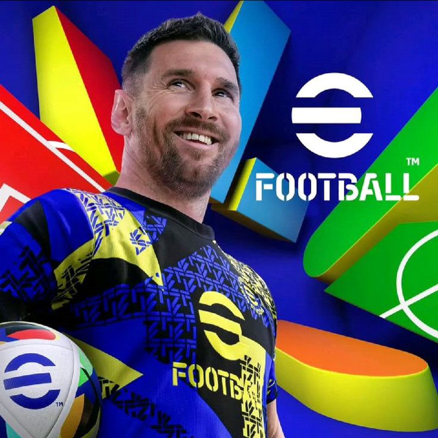

<!-- 🌟 GITHUB PROFILE AHMAD AZRIEL -->

  

<h3 align="center">💻 Siswa RPL | Web Developer | Frontend Enthusiast</h3>

  

---

  

## 🧠 Tentang Saya

Saya adalah siswa **Rekayasa Perangkat Lunak (RPL)** kelas 2 yang berfokus pada **pengembangan website**.  
Saya suka memadukan desain dan logika menggunakan **HTML, CSS, dan JavaScript** untuk membuat tampilan yang menarik dan interaktif.  
Saya percaya bahwa kode bukan sekadar teks — tapi seni digital yang bisa menghidupkan ide.

💬 Motto: *“Bukan hanya menulis kode, tapi membangun pengalaman pengguna.”*

  <video src="video/starboy.mp4" width="420" alt="Nagi Blue Lock"/>

---
## 🕹️ Tentang Gaming

Selain ngoding, saya juga aktif di dunia game! 🎮  
Saya sering main **eFootball**, dan saya percaya game juga bisa melatih strategi, refleks, dan ketelitian — sama seperti coding.

🎮 **Game Utama:** eFootball  
👑 **Nickname:** `PrinceRiel`  
🏆 **Rank Saat Ini:** Divisi 2  
⚡ **Gaya Bermain:** Strategis, menyerang cepat, dan fokus ke teamwork.  
🖥️ **Platform:** Mobile & PC  
💬 Kadang saya juga bikin taktik formasi dan analisa gameplay seperti dev yang ngatur sistem 😆  

  

---

## 🛠️ Bahasa & Teknologi

  
  
  

---

## 📂 Project Unggulan

| 🚀 Project | 🧩 Deskripsi | 🔗 Link |
|------------|--------------|---------|
| 💼 **Portofolio Pribadi** | Website resmi berisi profil & karya saya. | [🌐 Lihat](https://azrielportofolio.vercel.app/) |
| 🎧 **Music Player** | Pemutar musik berbasis web dengan tampilan clean. | [🎵 Buka](https://riel-musicplayer.vercel.app/) |
| 🎶 **Playlist Spotify** | Website berisi playlist musik favorit saya. | [🎧 Lihat](https://azrilgg.github.io/Azriel-fav-music/) |

---

## ⚙️ Tools yang Sering Saya Gunakan

  
  
  

---

## 📊 Statistik GitHub

  
  

---

## 🌍 Connect With Me

  
  
  

---

## 🧩 Fun Facts

- 🎧 Ngoding sambil dengerin musik itu wajib  
- ☕ Kopi bikin fokus, bukan insomnia  
- 🌙 Lebih produktif waktu malam  
- 💬 Sering bantu teman belajar HTML & CSS  

---

## 🐍 Animasi Kontribusi

  

---

## ✨ Quote of the Day
> *“Setiap error adalah petunjuk menuju solusi baru.”* ⚡

---

  

---
